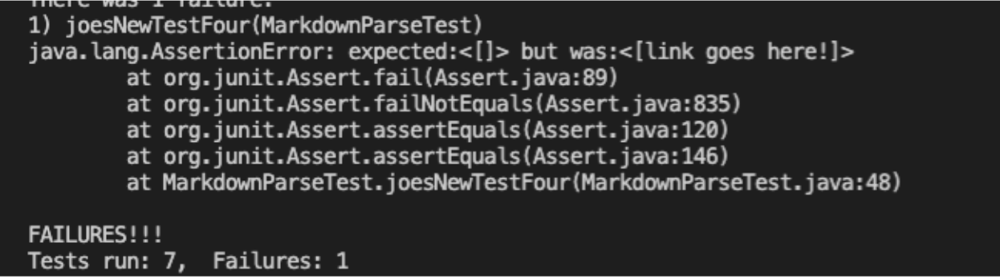
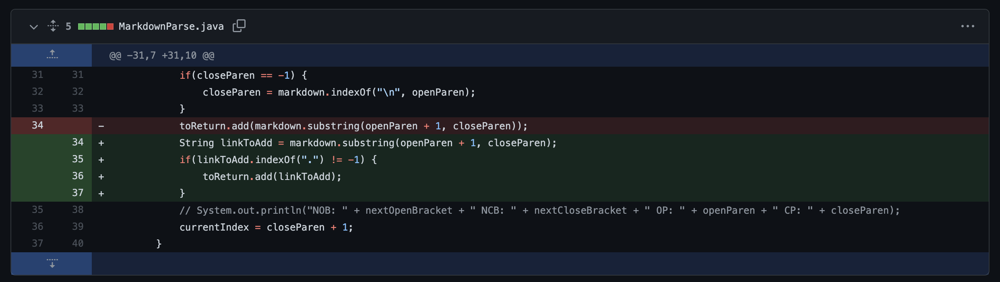
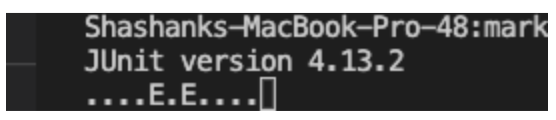
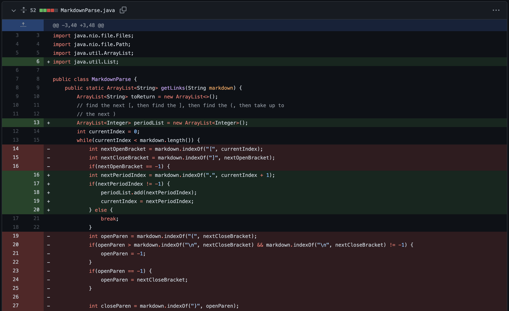
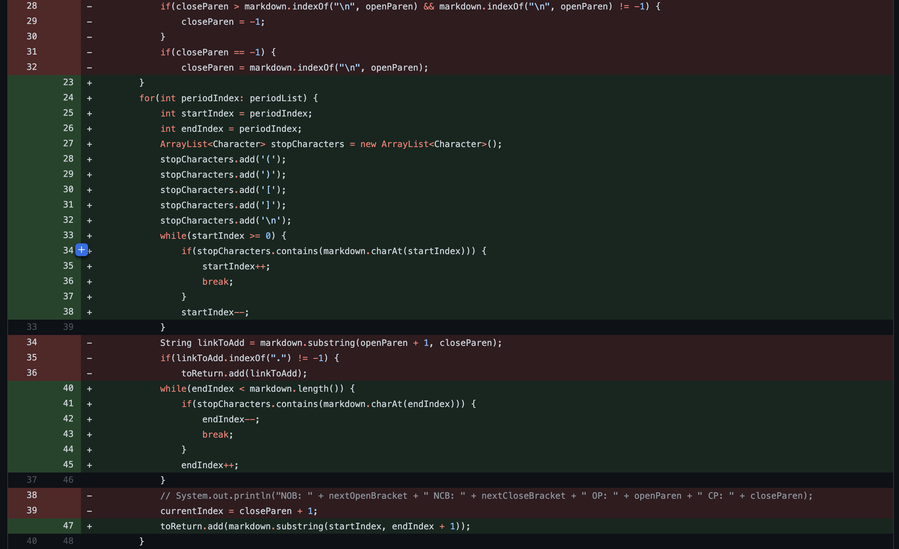
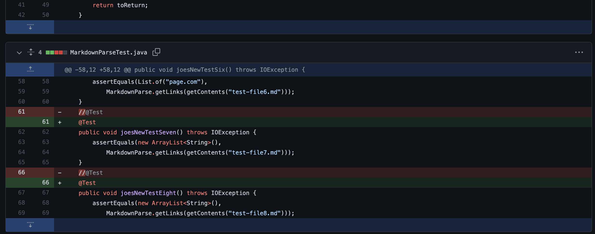

# Lab Report 2
## Error #1
We first dealt with a test that showed a link when there wasn't one. To give some context, here is the markdown text that induced the failure:

[First Fail](https://stevenli007.github.io/cse15l-lab-reports/first_fail.html)

Here is the symptom that we saw:

Here are the commands we used to get the symptoms:

`
javac -cp .:lib/junit-4.13.2.jar:lib/hamcrest-core-1.3.jar MarkdownParseTest.java
`

`
java -cp .:lib/junit-4.13.2.jar:lib/hamcrest-core-1.3.jar org.junit.runner.JUnitCore MarkdownParseTest
`

To elaborate, what happened was that our program saw some text after a pair of square brackets and interpreted that as a link, which it isn't because there is no suffix that begins with a period. Hence, we implemented the check shown below to make sure the "links" we return have periods in them, else we consider them invalid.

## Error #2 and #3
We then dealt with two infinite loops caused by the files linked below:

[Second Fail](https://stevenli007.github.io/cse15l-lab-reports/second_fail.html)

[Third Fail](https://stevenli007.github.io/cse15l-lab-reports/third_fail.html)

Here is the symptom we saw:

Here are the commands we used to get the symptoms:

`
javac -cp .:lib/junit-4.13.2.jar:lib/hamcrest-core-1.3.jar MarkdownParseTest.java
`

`
java -cp .:lib/junit-4.13.2.jar:lib/hamcrest-core-1.3.jar org.junit.runner.JUnitCore MarkdownParseTest
`

To elaborate, what happened was that our program was confused by the incomplete brackets in the two test files (link above). The program would get the `[` and be unable to find the next `]`. This would set `nextCloseBracket` to -1, which would mean, at the end of each iteration, `currentIndex` would be reset to 0, never moving forward and hence the infinite loop. To fix this, we chose to change our approach: instead of basing our search on the locations of brackets, we now start by finding the periods in the files. Then we would scan outward from where the period is until we hit a stop character (e.g. line breaks, open and close parentheses and brackets). 

