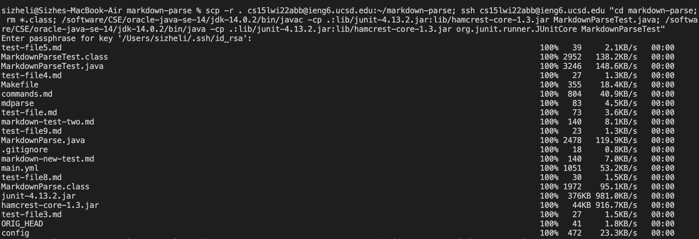
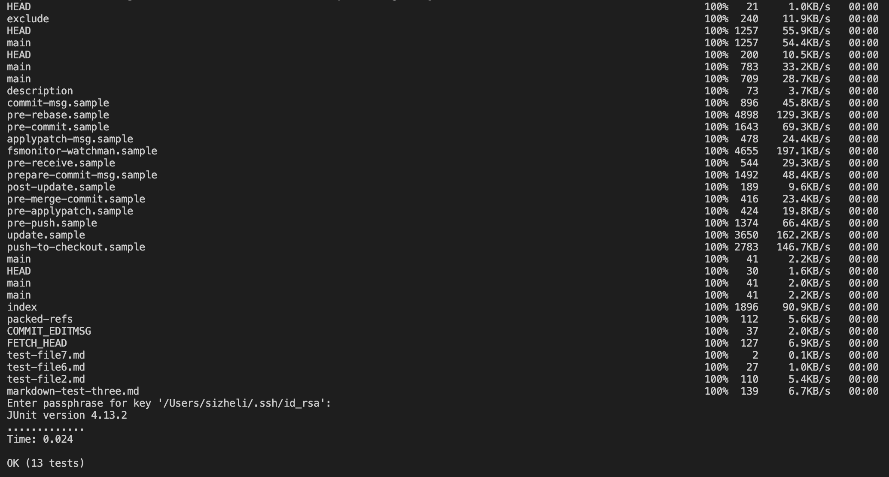

# Lab Report 3
## Copy whole directories with `scp -r`

Here is a screenshot of copying the entire directory to the remote machine:

You can see at the top my login to ieng6 and the command to begin copying. During the copying process, the files that are being copied show up in the left column, and its progress displayed in the right column.

Here is the results after the copying:

Now we can see the markdown-parse directory show up in blue on the remote machine through a simple `ls` comand. We can also `cd` into the markdown-parse directory, and then `ls` to display all the files.

Here is the results of compiling and running the tests on the remote machine:

We are able to successfully compile and run the tests.

Finally, here is the results on putting all the commands on one line:

I initially had trouble because of a similar error to the [Piazza posts](https://piazza.com/class/kxs0toocqhv4og?cid=353). However, we were able to fix this during office hours. Here are the changes we made and why we made them:

1. Change `javac` and `java` to `/software/CSE/oracle-java-se-14/jdk-14.0.2/bin/javac` and `/software/CSE/oracle-java-se-14/jdk-14.0.2/bin/java` respectively. 

    Reasoning: this is the workaround described in the Piazza posts that resolves the version difference.
2. Put double quotes around commands `cd markdown-parse; rm *.class; /software/CSE/oracle-java-se-14/jdk-14.0.2/bin/javac -cp .:lib/junit-4.13.2.jar:lib/hamcrest-core-1.3.jar MarkdownParseTest.java; /software/CSE/oracle-java-se-14/jdk-14.0.2/bin/java -cp .:lib/junit-4.13.2.jar:lib/hamcrest-core-1.3.jar org.junit.runner.JUnitCore MarkdownParseTest`. 

    Reasoning: that's a lot of commands, but the reason is simple: these are the commands that run remotely and the quotes signify that.
3. Added `rm *.class`. 
    
    Reasoning: this is related to the workaround in the first item; we are removing the old class files compiled on my machine which has a different version of Java installed relative to ieng6 and allowing it to be recompiled on ieng6.