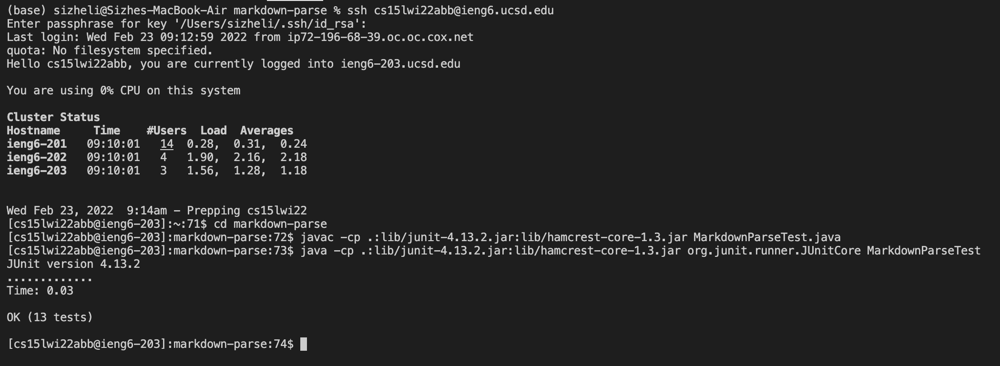

# Lab Report 3
## Copy whole directories with `scp -r`

Here is a screenshot of copying the entire directory to the remote machine:

You can see at the top my login to ieng6 and the command to begin copying. During the copying process, the files that are being copied show up in the left column, and its progress displayed in the right column.

Here is the results after the copying:

Now we can see the markdown-parse directory show up in blue on the remote machine through a simple `ls` comand. We can also `cd` into the markdown-parse directory, and then `ls` to display all the files.

Here is the results of compiling and running the tests on the remote machine:

We are able to successfully compile and run the tests. 