# Lab Report 4
[Our repo](https://github.com/StevenLi007/markdown-parse)

[The repo we reviewed](https://github.com/bimai25/markdown-parse)

Note: I ran into some trouble cloning the other group's repo and saving the changes, presumably because both repos had the same upstream (tentative presumption). Therefore, I copied over their `MarkdownParse.java` into my repo under the name `OtherMDP.java`, and their `MarkdownParseTest.java` as `OtherMDPT.java`. Hopefully this can prevent confusion in the screenshots below.

## Snippet 1
Here's what the snippet looks like with the VSCode preview:

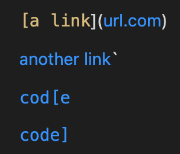

Here's the test I wrote for Snippet 1:

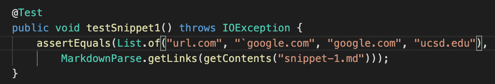

The test for the group we reviewed is slightly different:
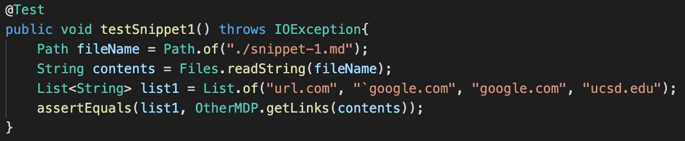

This passed for my group's implementation:

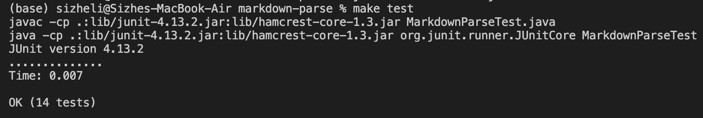

This did not pass for the group we reviewed:

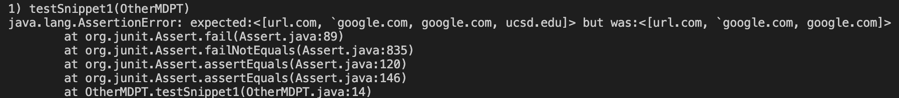

Question: Do you think there is a small (<10 lines) code change that will make your program work for snippet 1 and all related cases that use inline code with backticks? If yes, describe the code change. If not, describe why it would be a more involved change.

Answer: Given that our program produced the expected output with Snippet 1, I expect our program to be proficient with markdown files that include backticks. Furthermore, with the way we look for potential links, the backticks are treated as just any other character, so it should not pose any difficulties.

## Snippet 2
Here's what the snippet looks like with the VSCode preview:

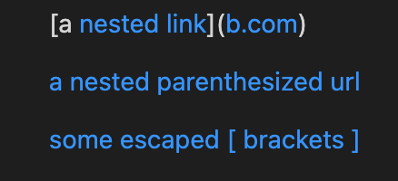

Here's the test I wrote for Snippet 2:

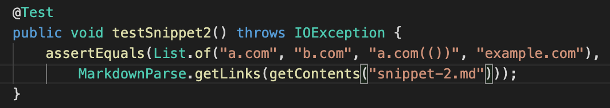

The test for the group we reviewed is slightly different:
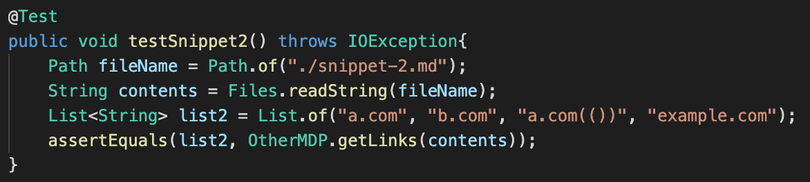

This did not pass for my group's implementation:

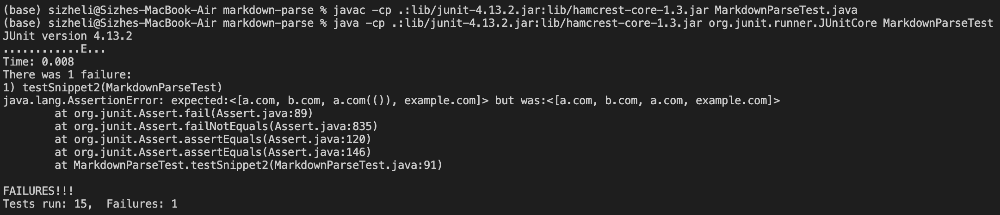

This did not pass for the group we reviewed:

Question: Do you think there is a small (<10 lines) code change that will make your program work for snippet 2 and all related cases that nest parentheses, brackets, and escaped brackets? If yes, describe the code change. If not, describe why it would be a more involved change.

Answer: As you can see from the JUnit output, the case that we failed was `a.com(())`; our program returned `a.com` instead. I think this would be an involved change as it would require us to change the ways we check for what we chose to call `stopCharacters`, or brackets and line breaks that indicate the link cannot contain those characters. While we built the program, we did not consider that `a.com(())` would be a valid link, and hence the oversight.

## Snippet 3
Here's what the snippet looks like with the VSCode preview:

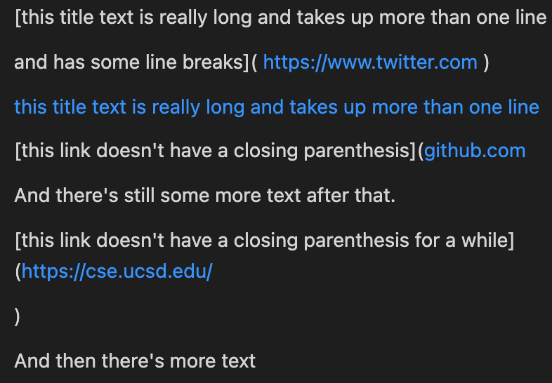

Here's the test I wrote for Snippet 3:

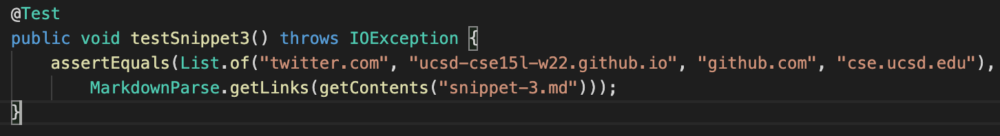

The test for the group we reviewed is slightly different:
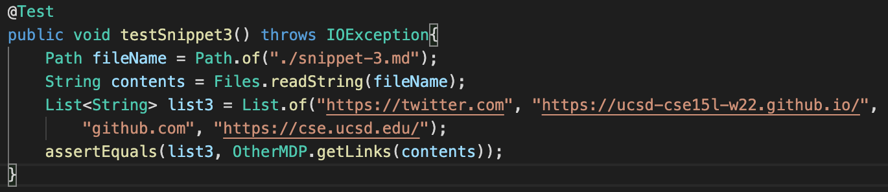

This did not pass for my group's implementation:

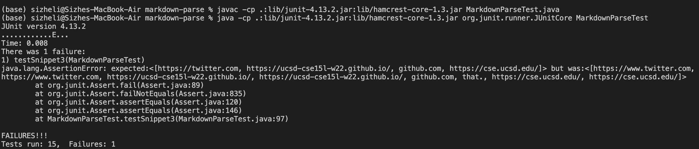

This did not pass for the group we reviewed:

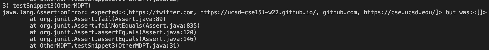

Question: Do you think there is a small (<10 lines) code change that will make your program work for snippet 3 and all related cases that have newlines in brackets and parentheses? If yes, describe the code change. If not, describe why it would be a more involved change.

Answer: As you can see, our program returned many more links than there are, and I believe it has to do with the way we are checking for periods and stop characters. Similar to snippet 2, this will most likely require a major change to the logic of how we are looking for links with our program.