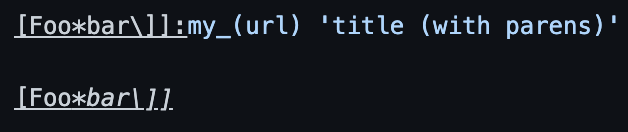

# Lab Report 5

## First difference: test file #109

I found this bug while completing Lab 8 with my group. I used `diff` and stored the results into a file, and this difference is one of the first I saw.

This is the test file:

This is the difference:

As you can see from the test file, there is no link, and thus our implementation (the result that follows `<`) is incorrect and the class implementation is correct.

The reason our implementation fails to parse the file correctly stems from the way we are looking for links.

As you may be able to tell from the variables in our code, our approach to parsing links was to find all the periods in the file, then radiate out from the period until we hit a `stopCharacter`. In this case, our program found the period, then radiated out until it found the space after the period, which is a `stopCharacter`, then returned that "link".

I don't think the problem can be solved by adding a `stopCharacter`, but we could add a specific check for `'. '` before we add possible links, since this can't possibly be part of a link.

Here's the code that we will add the check in:

## Second difference: test file #194

I found this bug while scrolling through `differences.txt`, the file I used to store the results of calling `diff` on the results of our group implementation and the class implementation.

This is the test file:

This is the difference:

This is more complicated than the previous case, so I used the preview to check for the expected output.

For this reason, I think both implementations are incorrect. Although the class implementation returned a non-empty list, it isn't the correct address. 

Since I'm more familiar with my group's implementation, I will talk about how we can solve the problem. I would say that this still has to do with our overall strategy of looking for periods, but it's definitely not the same fix as the previous problem.

For reference, here is the our code again:

Our thought process was that a valid link must contain a period, so if a file did not contain a period, we wouldn't perform any more parsing. Hence, for our program to fix this case, we would have to abandon this strategy (the previous fix maintained the general strategy while adding a specific case against `'. '`). This means abandoning the highlighted portion of the code, which represents our overall strategy of looking for periods. 

On a side note: while I know that our general strategy should be changed, I have no idea how we can change it to get the correct link as indicated by Github preview. I don't understand why the link wouldn't get `url`, and I'm unsure if this is even a valid link (can links have no periods?). If we were to fix it, it would be a complete overhaul, since we would have to consider all files regardless if they have a period or not. The code above is where we'd start fixing it.